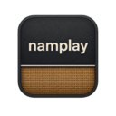
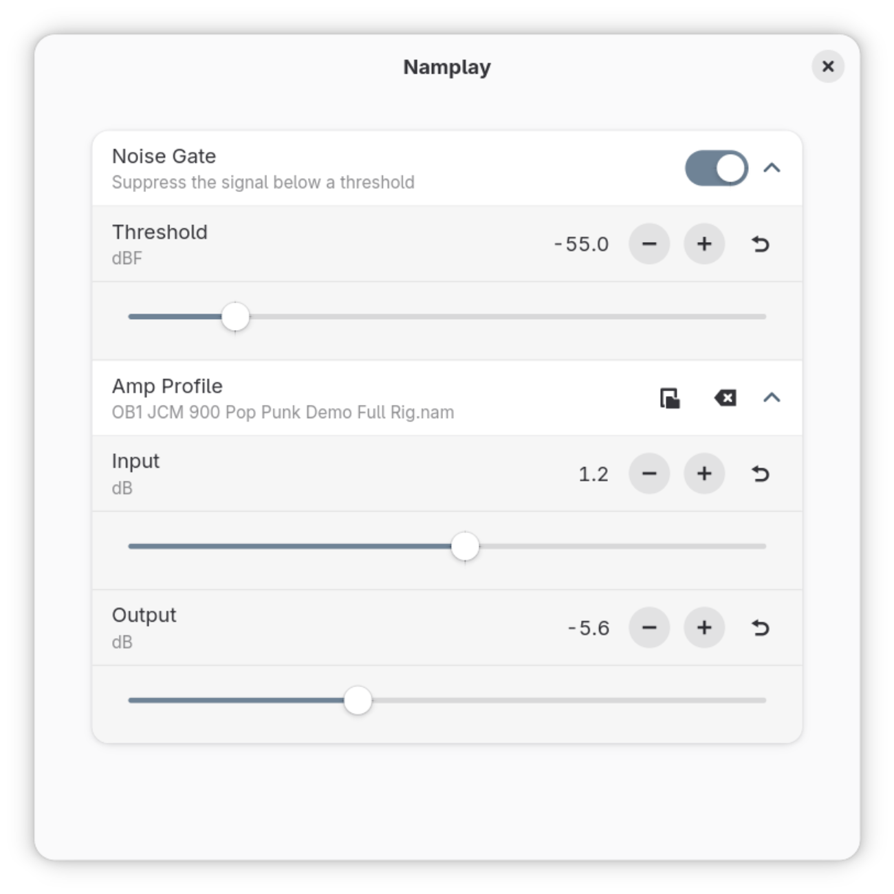

# Namplay

GTK4/Libadwaita app to run A2 [Neural Amp Modeler](https://github.com/sdatkinson/neural-amp-modeler) profiles via PipeWire's JACK



## ✨ Features

* Noise Gate
* 3-band EQ with High/Low Pass
* Pedal NAM Profile
* Amp/Rig NAM Profile
* Impulse Response
* Presets
* Tuner
* Input & output selector

## 🎯 Goals

* [x] linux-native (no Wine)
* [x] standalone (no DAW)
* [x] newbie-friendly (no complex setup)
* [x] simple (no bloat features)
* [x] lightweight (low CPU)
* [x] pretty (feets GNOME desktop)
* [ ] polished (no edge-case bugs)
* [ ] discoverable (Flathub)

From Flathub's [Generative AI Policy](https://docs.flathub.org/docs/for-app-authors/requirements#generative-ai-policy):

> Applications containing AI-generated or AI-assisted code, documentation, or any other content are not allowed.
> Exceptions may be granted for mature, well-maintained projects.

So if we get polished enough, eventually we can become discoverable!

## 🗃️ Dependencies

Namplay relies on JACK implementation based on PipeWire.

```sh
# Fedora
sudo dnf install pipewire-jack-audio-connection-kit
# Ubuntu
sudo apt install pipewire-jack
# Arch
sudo pacman -S pipewire-jack
```

## 📥 Installation

```sh
curl -sLO https://github.com/hedgieinsocks/namplay/releases/download/v0.5.0/io.github.hedgieinsocks.Namplay.flatpak
flatpak install --user io.github.hedgieinsocks.Namplay.flatpak
```

## 🔧 Configuration

Namplay does not feature a resampler (yet) so you should ensure PipeWire's JACK sample rate is set to 48000Hz, which is the most common value for IRs and .nam profiles. As for the buffer size, it can be adjusted from Namplay's Audio Settings.

```sh
cat ~/.config/pipewire/jack.conf.d/jack.conf
jack.properties = {
  node.latency = 256/48000
}
```

## 📜 License

[MIT](LICENSE)

## 🔈 AI Transparency & Attributions

This project is mainly vibe-coded with the help of Claude for my personal use. I'm not an audio engineer and don't write in rust, but I use my knowledge of other programming languages to keep it as simple and tight as possible. So far it meets my humble aesthetical and functional needs. Hopefully, you will find it useful as well.

* inspired by https://github.com/brummer10/NeuralRack
* made possible with https://github.com/OpenSauce/nam-rs
* icon by [Freepik](https://www.flaticon.com/authors/freepik) from [Flaticon](https://www.flaticon.com/)
