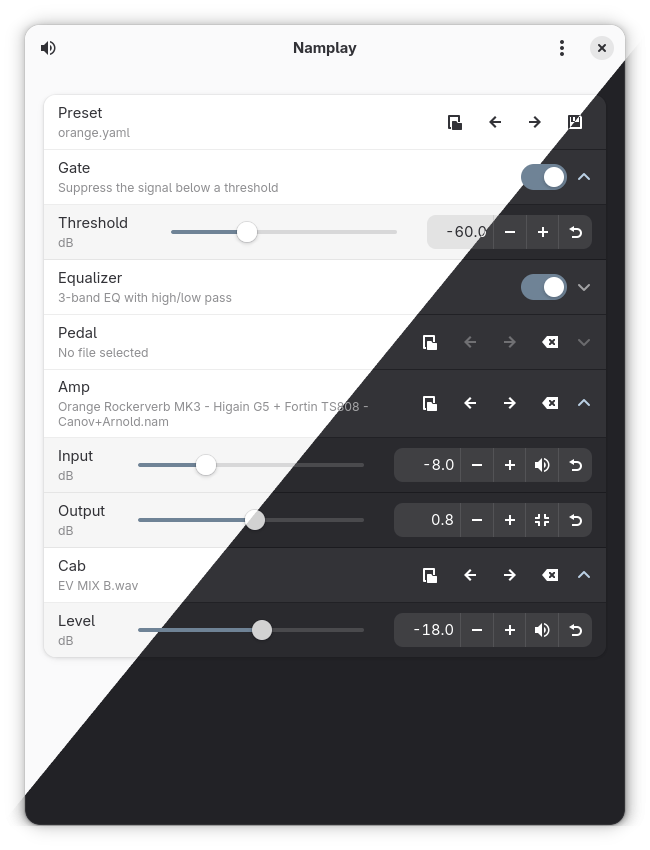

# Namplay

GTK4/Libadwaita standalone app to load and play A2 [Neural Amp Modeler](https://github.com/sdatkinson/neural-amp-modeler) captures via PipeWire's JACK



## ✨ Features

* 2 NAM slots for Pedal & Amp/Rig captures
* Impulse Response Cab slot
* 3-band EQ with High/Low Pass
* Noise Gate
* Tuner
* Save and load Presets
* Input & Output selector
* Headless mode
* Remote control

## 🎯 Goals

* [x] linux-native (no Wine)
* [x] standalone (no DAW)
* [x] newbie-friendly (no complex setup)
* [x] simple (no bloat features)
* [x] lightweight (low CPU)
* [x] pretty (fits GNOME desktop)

## 🗃️ Dependencies

Namplay is built for `x86-64-v3` CPUs and relies on JACK implementation based on PipeWire:

```sh
# Fedora
sudo dnf install pipewire-jack-audio-connection-kit
# Ubuntu
sudo apt install pipewire-jack
# Arch
sudo pacman -S pipewire-jack
```

## 📥 Installation

Download and install the latest flatpak release artifact:

```sh
curl -sLO https://github.com/hedgieinsocks/namplay/releases/download/v0.9.1/io.github.hedgieinsocks.Namplay.flatpak
flatpak install --user io.github.hedgieinsocks.Namplay.flatpak
```

## 🔧 Configuration

Namplay does not feature a resampler so you should ensure PipeWire's JACK sample rate is set to 48000Hz, which is the most common value for .wav impulse responses and .nam captures:

```sh
cat ~/.config/pipewire/jack.conf.d/jack.conf
jack.properties = {
  node.latency = 256/48000
}
```

As for the buffer size, it can be adjusted from Namplay's Settings.

## 🔘 Remote control

Use `--server` flag to spawn an HTTP server to serve a page with a simple full screen button that will allow you to use your smaprtphone as a footswitch:

* Toggle pedal bypass: http://192.168.0.110:8080/?mode=toggle?action=pedal-bypass
* Switch to the next amp capture: http://192.168.0.110:8080/?action=amp-next

For the full list of available actions, run the following command:

```sh
gdbus call --session --dest io.github.hedgieinsocks.Namplay \
  --object-path /io/github/hedgieinsocks/Namplay \
  --method org.gtk.Actions.List
```

## 📜 License

[MIT](LICENSE)

## 🔈 AI Transparency & Attributions

This project is mainly vibe-coded with the help of Claude for my personal use. I'm not an audio engineer and don't write in rust, but I use my knowledge of other programming languages to keep it as simple and tight as possible. So far it meets my humble aesthetical and functional needs. Hopefully, you will find it useful as well.

* inspired by https://github.com/brummer10/NeuralRack
* made possible with https://github.com/fabiohl/NeuralAmpModeler-rs
* icon by [Freepik](https://www.flaticon.com/authors/freepik) from [Flaticon](https://www.flaticon.com/)
